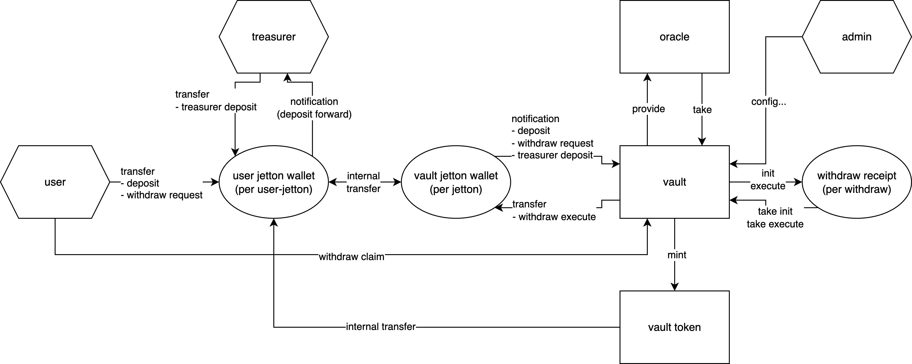

# sdk-solv-btc

SDK for Solv Bitcoin protocol on TON blockchain

## Installation

```bash
npm install github:factorial-finance/sdk-solv-btc#dist
```

## Overview



TypeScript SDK providing contract wrappers and business logic functions for interacting with Solv Vault on TON blockchain.

**Contracts Wrapper**

- Jetton: Minter, Wallet
- Solv: Vault, Oracle, Withdraw Receipt

**Functions**

- User: `deposit`, `withdrawRequest`, `withdrawClaim`
- Treasurer: `treasurer_deposit`

## Examples

See the [example](./example) folder for usage examples:

- [Basic Setup](./example/00-basic.ts) - Wallet and client initialization
- [Deposit](./example/01-deposit.ts) - Deposit assets to vault
- [Withdraw Request](./example/02-withdraw-request.ts) - Request withdrawal
- [Withdraw Claim](./example/03-withdraw-claim.ts) - Claim withdrawal with signature
